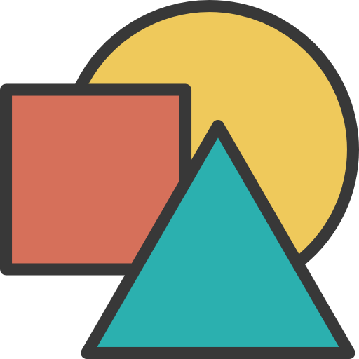

  

<h1 align="center">Element Randomizer</h1>

<h2 align="center">
  💻 <a href="https://element-randomizer.netlify.app/">Preview</a>
</h2>

## 🎯 Challenge

Esse projeto foi realizado no [Challenge 10 da FW7](https://github.com/fw7-solucoes/challenges/tree/master/challenge-10), um desafio com o propósito de estudo e gerar engajamento com a comunidade de desenvolvimento.

---

## 📕 Sobre

Nesse desafio o objetivo era criar uma interface onde o usuário possa clicar em um botão e deve ser gerado uma bolinha com uma cor, tamanho, velocidade e direção aleatória, e deve ser lançada na interface, conforme a bolinha bater em cada canto da interface ela deve serguir os princípios da física e mudar sua direção.

 

✅ Objetivos a serem alcançados. 
- Deve ser possível gerar uma bolinha.
- Deve ser possível gerar uma cor aleatória.
- Deve ser possível gerar um tamnho.aleatório.
- Deve ser possível gerar uma velocidade aleatória.
- Deve ser possível gerar uma direção aleatória.
- Deve seguir os princípios de colisão da física.

---

🎵 Música que escutei enquando fiz o **Challenge**: 😜 [Indie/Rock/Alternative Compilation - January 2021
](https://www.youtube.com/watch?v=WJ6UOey1apk)

Você pode ver o resultado final aqui: [Preview](https://element-randomizer.netlify.app/).

by [Roberto Umbelino](https://github.com/robertoumbelino)
