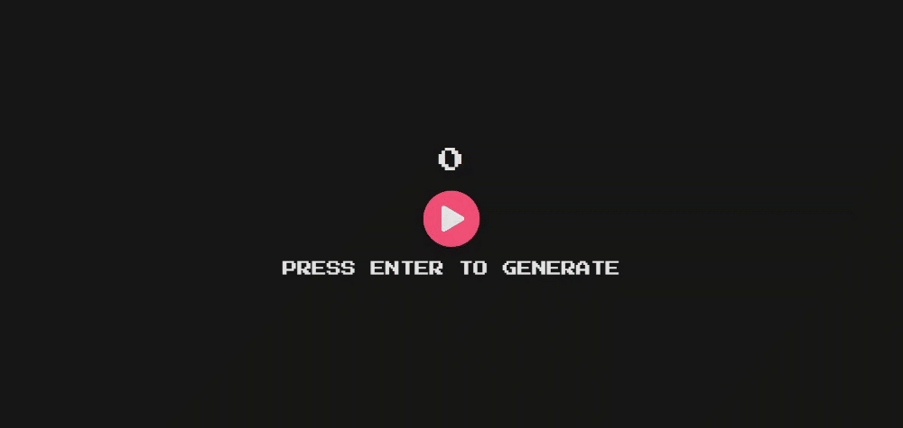

  

<h1 align="center">Element Randomizer</h1>

  

  

<h2 align="center">
  💻 <a href="https://element-randomizer.netlify.app/">Preview</a>
</h2>

## 🎯 Challenge

Esse projeto foi realizado no [Challenge 10 da FW7](https://github.com/fw7-solucoes/challenges/tree/master/challenge-10), um desafio com o propósito de estudo e gerar engajamento com a comunidade de desenvolvimento.

---

## 📕 Sobre

Nesse desafio o objetivo era criar uma interface onde o usuário possa clicar em um botão e deve ser gerado uma bolinha com uma cor, tamanho, velocidade e direção aleatória, e deve ser lançada na interface, conforme a bolinha bater em cada canto da interface ela deve serguir os princípios da física e mudar sua direção.

 

✅ Objetivos a serem alcançados.

- Deve ser possível gerar uma bolinha.
- Deve ser possível gerar uma cor aleatória.
- Deve ser possível gerar um tamanho aleatório.
- Deve ser possível gerar uma velocidade aleatória.
- Deve ser possível gerar uma direção aleatória.
- Deve seguir os princípios de colisão da física.

---

## 💪 Diferencial

Como é de praxe em todos os _challenges_ há um _plus_, implementações adicionais que estão fora do escopo, as minhas foram as seguintes.

 

✅ Implementações extras.

- Múscia de fundo.
- Efeitos sonoros.
- Randomização de elementos, além de **bolinhas**. (Triângulo, Círculo, Quadrado).
- Contador de elementos na tela.
- Disparar elementos pelo teclado.
- Gerado um 💩 a cada **5** _clicks_, com uma física diferente, quando colide na parede ele fica grudado.

---

### 📚 Novos conhecimentos

Por mais mínimo que seja o projeto, sempre será aprendido algo novo, e nesse projeto o que adquiri de conhecimento foi:

 

#### #️⃣ **getBoundingClientRect**

**Sobre**:
Uma função do **DOM API** que tem como objetivo retornar o tamanho de um elemento e sua posição relativa ao _viewport_.

**Uso**: Utilizado para identificar onde cada elemento estava posicionado para poder realizar o "movimento" e "direção" dos elementos. 

**Para mais informação** [Acesse aqui](https://developer.mozilla.org/pt-BR/docs/Web/API/Element/getBoundingClientRect).

#### #️⃣ **new Audio**

**Sobre**:
É uma classe utilizada para construir e retornar um novo **HTMLAudioElement**, dessa forma podendo realizar os controles da tag de _audio_.

**Uso**:
Para realizar os efeitos sonoros referente aos elementos em tela.

**Para mais informação** [Acesse aqui](https://developer.mozilla.org/en-US/docs/Web/API/HTMLAudioElement/Audio).

#### #️⃣ **-webkit-tap-highlight-color**

**Sobre**:
É uma propriedade do **CSS** para definir uma cor de _highlight_ que aparece sobre um elemento que foi clicado. Essa _feature_ ainda não faz parte dos recursos padrões do **CSS** e ainda não se deve utilizar em produção.

**Uso**:
Para remover a cor de _highlight_ do botão de _play_ na versão _mobile_.

**Para mais informação** [Acesse aqui](https://developer.mozilla.org/en-US/docs/Web/CSS/-webkit-tap-highlight-color).

---

## 🚀 Tecnologias utilizadas

Tecnologias que utilizem para resolução desse desafio.

- HTML5
- CSS3
- Javascript
- Netlify

---

🎵 Música que escutei enquando fiz o **Challenge**: 😜 [Indie/Rock/Alternative Compilation - January 2021
](https://www.youtube.com/watch?v=WJ6UOey1apk)

Você pode ver o resultado final aqui: [Preview](https://element-randomizer.netlify.app/).

by [Roberto Umbelino](https://github.com/robertoumbelino)
